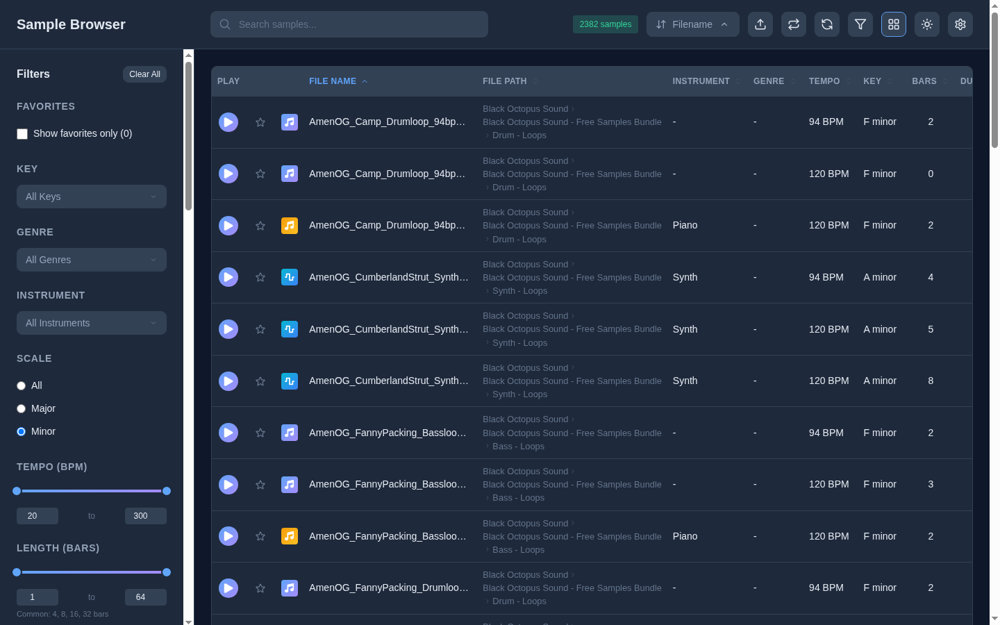

<p align="center">
  
</p>

# Sample Browser

<!-- BADGES:START -->


[](LICENSE.md)
[](CONTRIBUTING.md)
<!-- BADGES:END -->

## Table of Contents

- [Description](#description)
- [Screenshots](#screenshots)
- [Features](#features)
- [Requirements](#requirements)
- [Installation](#installation)
  - [Running without Docker](#running-without-docker)
- [Usage](#usage)
  - [Finding samples](#finding-samples)
  - [Listening](#listening)
  - [Favorites and settings](#favorites-and-settings)
  - [How filenames are read](#how-filenames-are-read)
  - [Supported formats](#supported-formats)
  - [Uploading](#uploading)
- [Configuration](#configuration)
- [API Reference](#api-reference)
- [Architecture](#architecture)
- [Credits](#credits)
- [Contributing](#contributing)
- [License](#license)

## Description

A self-hosted web app for finding your way around a large library of audio
samples, loops and MIDI files. Point it at a folder, and it indexes every file:
tempo, key and instrument from the filename, and sample rate, bit depth,
channels and length from the file itself. You can then search, filter and
audition the whole library in the browser.

It runs as two Docker containers, a FastAPI backend and a Next.js frontend, and
mounts your library **read-only**.

## Screenshots

<p align="center">
  
</p>

<p align="center"><em>The table view, filtered to minor-key loops. Tempo, key and length in bars were read from each file's name and audio.</em></p>

## Features

**Browsing**

- Grid, list and sortable table views, with a choice of which fields to show
- A folder tree with a count for each directory, and a folder's cover art when
  it has some
- Dark and light themes

**Searching and filtering**

- Full-text search across filename, folder, instrument and descriptors
- Multi-select filters for key, genre, instrument and file type
- Range filters for tempo, length in bars, duration, sample rate and file size
- Filters for scale, loop or one-shot, audio or MIDI, time signature, bit depth,
  channels, processed or dry, polyphonic or monophonic, tags and date added

**Listening**

- In-browser playback with a waveform, volume and loop controls; starting one
  sample stops the last
- MIDI files synthesised to audio on the server with FluidSynth
- CAF files transcoded to WAV on the server with ffmpeg
- Both conversions cached, so the second play is fast

**Organising**

- Favorites, kept in your browser
- Backup and restore of favorites and settings as a JSON file
- A rescan button, and optional watching for new files

## Requirements

- **Docker** with the Compose plugin
- A folder of samples to index
- Ports **3000** (web) and **8000** (API) free on the host. The browser calls
  the API directly.
- To run without Docker instead: **Python 3.11+** with `ffmpeg`, `fluidsynth` and
  a General MIDI SoundFont installed, and **Node.js 20+**

## Installation

```bash
git clone https://github.com/geoffmyers/sample-browser.git
cd sample-browser

cp .env.example .env
cp docker-compose.example.yml docker-compose.yml
```

Edit `.env` and set at least these two paths:

```bash
DATA_PATH=/srv/sample-browser/data   # the index and caches; must be writable
AUDIO_PATH=/srv/audio/samples        # your library; mounted read-only
```

Then create the Docker network the compose file joins, get both images and
start them. The images are published on the GitHub Container Registry
(`ghcr.io/geoffmyers/sample-browser-api` and `-web`, for `linux/amd64`
and `linux/arm64`), so `docker compose pull` fetches them; `docker compose build`
builds them from this checkout instead.

```bash
docker network create sample-browser
docker compose pull            # or: docker compose build
docker compose up -d
```

Open [http://localhost:3000](http://localhost:3000). The first scan starts on
its own, and the page refreshes its results when the scan finishes.

The browser calls `/api` on the web app's own address, and the web app
forwards those requests to the API container (`API_INTERNAL_URL`), so the
published images work from any machine without rebuilding. A reverse proxy
can route `/api` to the API directly instead; the app works either way.

### Running without Docker

The backend keeps its caches under `/data`, so that directory must exist and be
writable.

```bash
# API on port 8000
cd backend
pip install -r requirements.txt
DATABASE_PATH=/data/samples.db AUDIO_PATH=/path/to/samples \
  uvicorn app.main:app --reload --port 8000

# Frontend on port 3000, in another terminal
cd frontend
npm install
npm run dev
```

## Usage

### Finding samples

- **Search** from the box at the top. Every word must match.
- **Filter** from the sidebar, which the filter button shows and hides. **Clear
  All** resets everything.
- **Browse by folder** with the directory tree at the bottom of the sidebar.
- **Sort** from the menu at the top, or by clicking a column in the table view.
- **Switch views** with the grid, list and table button.

### Listening

Press play on any sample. Waveforms are drawn when a sample first plays, and the
loop button in the header repeats whatever is playing. The download button on
each row saves the file; CAF and MIDI files arrive as the converted WAV.

### Favorites and settings

Star a sample to add it to your favorites; **Show favorites only** narrows the
list to them. Favorites live in your browser's local storage, so use **Settings
→ backup** to move them to another browser.

### How filenames are read

Metadata is parsed from each file's name and the folders above it. This is what
the parser returns for a few names:

| Path | Instrument | Key | Tempo | Genre | Descriptors | Loop |
|---|---|---|---|---|---|---|
| `Funky_Bass_Cmaj_120bpm.wav` | Bass | C major | 120 | | funky, cmaj | |
| `808_Kick_Hard.wav` | 808 | | | | hard | |
| `Piano_Chords_G_minor_85bpm.wav` | Piano | G minor | 85 | | 85bpm | |
| `Neo Soul Keys Pack/Rhodes/Rhodes_Chords_Am_90bpm.wav` | Rhodes | A minor | 90 | Neo Soul | neo, am, 90bpm | |
| `Drums/Loops/Drums_140bpm.wav` | Drums | | 140 | | | yes, from the folder |

Genres are matched anywhere in the path, and folder names are added as
searchable descriptors, except generic ones such as `Drums` and `Loops`. Sample
rate, bit depth, channels and duration come from the audio itself.

Loop and one-shot words (`Loop`, `One_Shot`, `Stab`…), wet and dry words
(`Wet`, `Reverb`, `Dry`, `Raw`…) and time signatures (`4_4`, `6_8`…) count
however they are separated: by spaces, underscores, hyphens or folders.
`Pad_Loop.wav` is a loop, `Drums_4_4_140bpm.wav` is in 4/4, and `Drywall_Hit.wav`
is not dry. `backend/tests/test_parser.py` checks these cases and every row of
the table above.

### Supported formats

| Format | Extensions | Playback |
|---|---|---|
| WAV, MP3, FLAC, OGG | `.wav`, `.mp3`, `.flac`, `.ogg` | Streamed as-is; every current browser plays them |
| M4A | `.m4a` | Streamed as-is; plays when it holds AAC, not always when it holds ALAC |
| AIFF | `.aif`, `.aiff` | Streamed as-is; Safari plays it, Chrome and Firefox do not |
| WMA | `.wma` | Indexed and streamed as-is; most browsers cannot play it |
| CAF | `.caf` | Transcoded to WAV with ffmpeg on the server, then cached |
| MIDI | `.mid`, `.midi` | Rendered to WAV with FluidSynth on the server, then cached |

### Uploading

The upload button sends files into a folder under `AUDIO_PATH` (`uploads/` by
default) and indexes them. Because the example compose file mounts the library
**read-only**, uploads fail until you make that mount writable.

## Configuration

Set in `.env`; `.env.example` lists them all with comments.

| Variable | Default | What it does |
|---|---|---|
| `DATA_PATH` | *(required)* | Host folder for the index database and caches |
| `AUDIO_PATH` | *(required)* | Host folder holding your library |
| `NETWORK_NAME` | `sample-browser` | Existing Docker network to join |
| `PUBLISHED_PORT` | `3000` | Host port for the web app |
| `API_INTERNAL_URL` | `http://sample-browser-api:8000` | Where the web app forwards the browser's `/api` requests; read at start-up |
| `NEXT_PUBLIC_API_URL` | *(empty)* | Build time only: an API on another origin for the browser to call directly, instead of `/api` on the app's own |
| `CORS_ORIGINS` | `http://localhost:3000,http://127.0.0.1:3000` | Origins the API accepts requests from |
| `SCAN_ON_STARTUP` | `true` | Index the library when the API starts |
| `WATCH_FOR_CHANGES` | `false` | Re-index as files change; uses more resources |
| `LOG_LEVEL` | `info` | `debug`, `info`, `warning` or `error` |
| `PUID`, `PGID` | `568` | User and group the containers run as |
| `TZ` | `UTC` | Time zone |
| `DOMAIN`, `TRAEFIK_*` | `example.com` | Labels for a Traefik reverse proxy, which serve the app at `sample-browser.<DOMAIN>`; harmless without Traefik |
| `HOMEPAGE_GROUP` | `Media` | Group for a [Homepage](https://gethomepage.dev/) dashboard tile |
| `API_*_LIMIT`, `WEB_*_LIMIT` | see `.env.example` | CPU and memory limits |

## API Reference

All routes are under `/api`. FastAPI serves interactive documentation at
[http://localhost:8000/docs](http://localhost:8000/docs).

| Method | Route | What it does |
|---|---|---|
| `GET` | `/api/samples` | A page of samples, filtered and sorted |
| `GET` | `/api/samples/search?q=` | Full-text search |
| `GET` | `/api/samples/{id}` | One sample |
| `GET` | `/api/samples/{id}/audio` | Streams the audio, converting CAF and MIDI to WAV first; `?download=true` sends it as an attachment, `?transcode=false` skips the conversion |
| `GET` | `/api/samples/directories` | Folders with counts |
| `GET` | `/api/samples/instruments`, `/keys`, `/genres`, `/file-types` | Filter values with counts |
| `GET` | `/api/samples/directory-image?directory=` | A folder's cover art |
| `POST` | `/api/samples/scan` | Starts a rescan |
| `GET` | `/api/samples/scan/status` | Progress of the current scan |
| `POST` | `/api/samples/upload?directory=` | Uploads files (rate-limited to 30 a minute) |
| `GET` | `/api/health` | Health check |

`/api/samples` accepts `q`, `directory`, `instrument`, `genre`, `key`, `scale`,
`tempo_min`/`tempo_max`, `duration_min`/`duration_max`, `bars_min`/`bars_max`,
`sample_type`, `is_loop`, `is_processed`, `is_polyphonic`, `time_signature`,
`sample_rate_min`/`sample_rate_max`, `bit_depth`, `channels`,
`file_size_min`/`file_size_max`, `file_extension`,
`created_at_min`/`created_at_max`, `ids`, `sort_by`, `sort_order`, `page` and
`per_page`. List filters take comma-separated values, for example
`?instrument=Piano,Guitar`.

## Architecture

```
browser ──► sample-browser-web (Next.js, :3000)
   │
   └──────► sample-browser-api (FastAPI, :8000) ──► /data  (index, caches; read-write)
                                                 └─► /audio (your library; read-only)
```

| Path | Role |
|---|---|
| `backend/app/main.py` | FastAPI app and start-up scan |
| `backend/app/routers/samples.py` | Listing, search, filters, streaming, CAF and MIDI conversion, upload |
| `backend/app/services/` | `scanner.py` (walks the library, reads audio metadata), `parser.py` (filenames), `indexer.py` (database writes), `images.py` (cover art) |
| `backend/app/database/` | SQLite schema with an FTS5 full-text index |
| `backend/app/models/` | Pydantic models |
| `frontend/app/components/` | `SampleBrowser`, `FilterPanel`, `SampleCard`, `SampleTable`, `AudioPlayer`, `Waveform`, `DirectoryTree`, `SettingsModal` and friends |
| `frontend/app/lib/` | API client, types, and the settings, favorites and audio contexts |

Everything the backend writes lives under `/data`: `samples.db`, `midi_cache/`
and `transcode_cache/`. Cache entries are keyed on a hash of the file path and
its modification time, so an edited file is converted again.

See [ARCHITECTURE.md](ARCHITECTURE.md) for more detail.

## Credits

- Backend: [FastAPI](https://fastapi.tiangolo.com/),
  [Uvicorn](https://www.uvicorn.org/), [Pydantic](https://docs.pydantic.dev/),
  [mutagen](https://mutagen.readthedocs.io/), [mido](https://mido.readthedocs.io/),
  [filetype](https://github.com/h2non/filetype.py),
  [watchfiles](https://watchfiles.helpmanual.io/) and
  [SlowAPI](https://github.com/laurentS/slowapi).
- Audio conversion: [FFmpeg](https://ffmpeg.org/) and
  [FluidSynth](https://www.fluidsynth.org/), with the FluidR3 General MIDI
  SoundFont from Debian's `fluid-soundfont-gm` package.
- Frontend: [Next.js](https://nextjs.org/) and [React](https://react.dev/).
  Icons from [Font Awesome Free](https://fontawesome.com/) (icons under CC BY
  4.0, code under MIT).

Written by Geoff Myers.

## Contributing

Bug reports and pull requests are welcome. See [CONTRIBUTING.md](CONTRIBUTING.md)
for setup, checks and how this repository is published.

## License

This program is free software: you can redistribute it and/or modify it under
the terms of the GNU General Public License as published by the Free Software
Foundation, either version 3 of the License, or (at your option) any later
version.

This program is distributed in the hope that it will be useful, but WITHOUT ANY
WARRANTY; without even the implied warranty of MERCHANTABILITY or FITNESS FOR A
PARTICULAR PURPOSE. See [LICENSE.md](LICENSE.md) for the full text of the GNU
General Public License.

SPDX-License-Identifier: `GPL-3.0-or-later`
